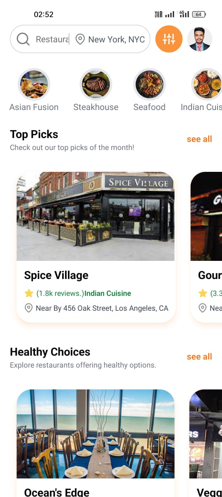
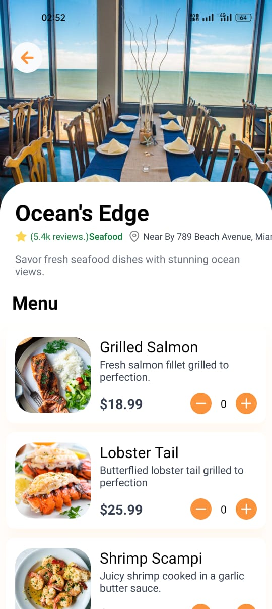
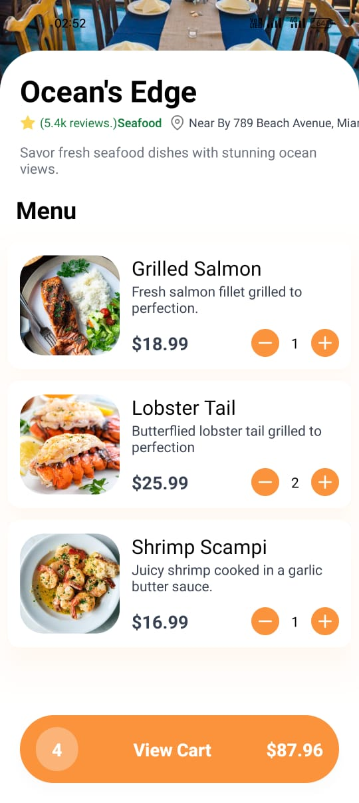
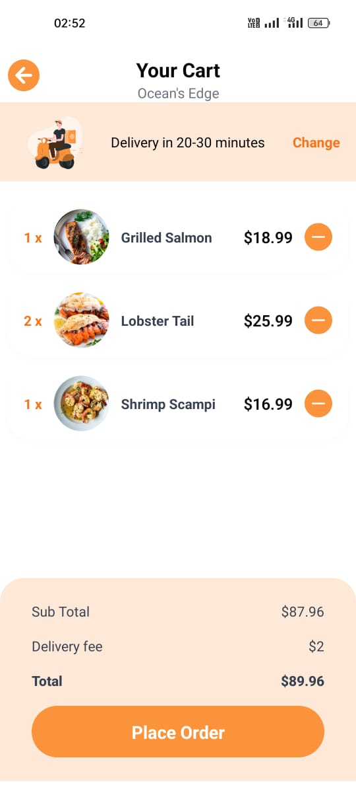
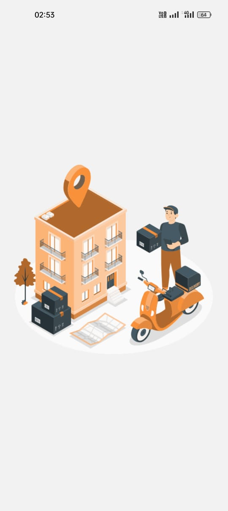
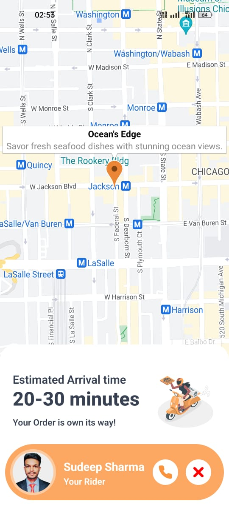

# Delivero
# home screen

# Restaurant screen

# Items screen

# Cart screen

# Loader

# Order screen

## Description
delivero is food delivery app

## Features
Discover: Explore a vast array of cuisines from top-rated restaurants in your area. Whether you're craving sushi, pizza, or vegan delights, Delivero has something for every palate.

Customize: Tailor your order to perfection with customizable options and special requests. From extra cheese to no onions, we ensure your meal is prepared exactly the way you like it.

Track: Follow the journey of your order in real-time with our live tracking feature. Know exactly when your food will arrive, so you can plan your day accordingly.

Savor: Delight in the convenience of doorstep delivery without sacrificing quality. Our commitment to freshness and flavor ensures that every bite is a culinary delight.

Connect: Join a vibrant community of food lovers and share your favorite dishes, reviews, and recommendations. Connect with fellow foodies and discover new culinary adventures together.

Experience: Elevate your dining experience with exclusive deals, promotions, and rewards. Whether it's a special occasion or a casual night in, Delivero adds a touch of indulgence to every meal.

## Installation
Steps to install and run your project locally.
# for Android User

# for Ios User

## Usage
How to use your project, including examples or screenshots.

## Contributing
Guidelines for contributing to your project.

## License
Information about the license of your project.

